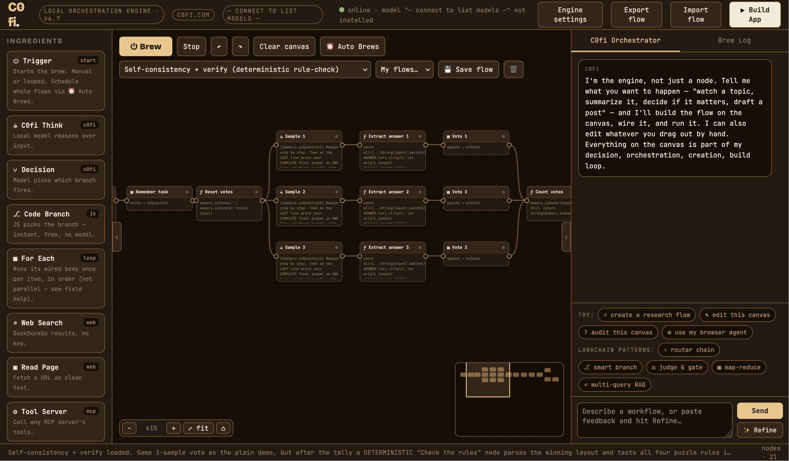

# C0fi

**Single-file visual workflow builder where your local LLM builds, wires, and runs the flows — n8n-style canvas, 100% on your machine via Ollama.**



C0fi is in the spirit of n8n, rebuilt around one inversion — the whole canvas is a single loop the model lives inside: **decide → orchestrate → create → build → run → learn**. Via [Ollama](https://ollama.com), the model **decides** (Decision/Critic nodes), **orchestrates** (a chat panel that sees the whole canvas and rewires it), **creates** (describe a flow in plain language and it builds the nodes and wires), and **builds** (edits, extends, and re-runs flows mid-conversation, including ones you drew by hand) — then you **run** the flow and **learn** from what comes back in the Brew Log, feeding the next pass.

Everything runs in one HTML file against your own Ollama. No accounts, no telemetry, no cloud. Flows export as JSON you own; finished flows export as standalone single-file apps; and flows can now **run themselves on a schedule** (Auto Brews).

- **App:** [`c0fi-v6.7.html`](c0fi-v6.7.html)
- **Full user guide:** [`c0fi-user-guide-v6.7.html`](c0fi-user-guide-v6.7.html) — open it in a browser

---

## Quickstart

**Requirements:** [Ollama](https://ollama.com) + a mid-size instruct model (7B–14B handles the strict-JSON orchestration well), and `python3` (standard library only — no `pip install`) for real web search / page reading.

```bash
# 1. Start Ollama with browser origins allowed (a second instance on its own port
#    sidesteps the desktop app that owns 11434):
OLLAMA_HOST=127.0.0.1:11435 OLLAMA_ORIGINS="*" ollama serve

# 2. From this folder, launch the local engine + open the app:
./start.sh                     # search + read + MCP tools on :8790, opens the newest c0fi-v*.html
./start.sh --with-page-agent   # also starts the Page Agent bridge (real browser actions)
```

Then in the app: **Engine settings** → set the endpoint to `http://localhost:11435`, press **Enter** to connect, pick a model, **Save**. The header dot goes green. Load a demo from the dropdown and hit **⏻ Brew**.

> **Standalone mode:** with *only* Ollama running (no `c0fi_server.py`), C0fi still works — Web Search and Read Page fall back through DuckDuckGo instant answers and the keyless r.jina.ai reader automatically. The local engine just upgrades quality and adds real result pages.

See the [user guide](c0fi-user-guide-v6.7.html) §2 for the CORS details, the single-instance method, and troubleshooting.

---

## What's in the box

| File | What it is |
| --- | --- |
| `c0fi-v6.7.html` | The whole app — canvas, node palette, Orchestrator, Build App, Auto Brews, 21 demos. One file, no build step. |
| `c0fi-user-guide-v6.7.html` | Complete guide (setup, every node, MCP, the brew model, Auto Brews, recipes, troubleshooting). |
| `c0fi_server.py` | Zero-dependency local engine on `:8790` — real DuckDuckGo search + clean page reading, an MCP tool surface (`web_search`, `read_page`, `ask_llm`), and `kb_search`/`kb_list` RAG over `knowledge/`. |
| `mcp_stdio_bridge.py` | Generic adapter that exposes any stdio MCP server over HTTP+CORS, so browser-based C0fi can reach the wider MCP ecosystem. |
| `start.sh` | Launcher — starts the engine, opens the newest app version, cleans up its children on `Ctrl+C`. |
| `knowledge/` | Sample RAG collections: `coffee/` (a demo shop KB), `cofi-guide/` (C0fi's own docs), `user-docs/` (drop your own `.txt`/`.md` here). |
| `test/` | Headless jsdom test harness (see below). |
| `archive/` | Every earlier `c0fi-vX.Y.html` and user guide, kept for reference and the test self-check. |

## Nodes

`Trigger` · `C0fi Think` · `Decision` · `Code Branch` · `For Each` · `Gather` (join/barrier → array) · `Web Search` · `Read Page` · `Tool Server` (MCP) · `Watch Task` · `HTTP Request` · `Transform` (JS) · `Memory` (shared blackboard) · `Critic Loop` · `Interaction` (live chat) · `Output`.

Drag them from the palette, or just describe what you want in the Orchestrator and let C0fi wire it.


*Above: one of the 21 built-in demos — three samples each reason step-by-step over the same puzzle and cast a vote, a majority tally picks the winner, then a deterministic "Check the rules" node tests the winning answer against the puzzle's actual rules in plain JS; only a rule-valid answer clears the Code Branch, and a wrong majority is routed to a Reject-and-explain node instead of being trusted. Voting alone can launder a systematic model error into false confidence — the verifier checks the answer, not the model.*

## Auto Brews — flows that run themselves

The **⏰ Auto Brews** button (next to *Clear canvas*) schedules whole flows to brew automatically — **every N minutes** or **daily at a time**. Build a flow, confirm it with **⏻ Brew**, then deploy it to the Auto Brews list; deploy as many as you want, each **pausable, deletable, and running independently**. Every run can **auto-save its result to a `.txt`** file, and there's a **⤓ Save .txt** for the last result on demand.

A background run **snapshots your canvas, runs the scheduled flow, and restores your canvas** — it never loses the work you have open and won't hijack the canvas mid-edit. A single engine lock keeps brews from colliding: a busy engine **holds and retries** instead. Deleting a brew that's running **stops it** for you.

> **Tier 1 (in-browser):** Auto Brews fire while the C0fi tab stays open and the machine is awake — closing the tab pauses them. Deployed brews persist across reloads. See guide §11.

## Build App

The **▶ Build App** button turns the current flow into a standalone `.html` — the same engine with the flow baked in and the builder chrome hidden. A flow with an Interaction node becomes a **chat app**; a batch flow becomes a **form app**. Exported apps still need Ollama reachable (and `c0fi_server.py` if the flow uses web/tool nodes) — if one opens with no engine in reach, it shows a short "run me on Ollama" hint instead of failing silently.

> An exported app runs its baked-in `Transform`/`Code Branch` JavaScript on the opener's machine and talks to their local engine — **only share apps you built, and only open ones from people you trust.**

---

## Testing

A headless [jsdom](https://github.com/jsdom/jsdom) harness runs without a browser or Ollama.

```bash
cd test
npm install        # first time only — pulls jsdom (this is the 25MB node_modules, git-ignored)
npm test           # smoke (build/boot, all 21 demos, export round-trips) + runtime (brews flows)
npm run test:self  # also runs known-broken archived versions, which MUST fail (proves the harness)
```

- **`smoke.mjs`** catches the two bug classes that slip past syntax checks: a stray `</script>` truncating the inline script, and null-deref after a DOM wipe. It auto-targets the newest `c0fi-v*.html` in the root.
- **`runtime.mjs`** actually *brews* flows headlessly — verifying Gather joins to one array, the fan-in count-join idiom still works, undo/redo round-trips, and the focus-mode chat surfacing.

---

## What's new in v6.7 — Auto Brews

- **⏰ Auto Brews** — deploy whole flows to a scheduled list that brews automatically (**every N minutes** or **daily at HH:MM**) while the tab is open. Many brews run independently; each persists across reloads.
- **Deploy / Pause / Run now / Update flow / Delete** per brew — plus a live active/total count on the button.
- **Auto-save results to `.txt`** — each run can download its Output as a timestamped file; a **⤓ Save .txt** grabs the last result anytime.
- **Swap-run-restore** — a background brew snapshots your canvas, runs the scheduled flow, and restores your open work untouched; it won't hijack the canvas while you're editing.
- **One engine lock, hold-and-retry** — brews never collide; a busy engine makes a manual run retry in 2 min and a scheduled run retry every 15 s.
- **Stop-on-delete** — deleting an Auto Brew that's mid-run stops it for you.

<details>
<summary>Earlier — v6.2</summary>

- **Model pool** — Engine settings holds four model slots (Model, Verifier, Model C, Model D), so one flow can mix different local models.
- **Per-node model override** — each node has a live dropdown of your available models plus slot tokens (`@1`–`@4`); a judge, a critic, and a drafter can each run on a different model.
- **Verifier bench + repair loop demo** — three independent judges (reading the Verifier / Model C / Model D slots) score a draft, a Count+Branch join waits for all three, and anything flagged routes to a repair specialist.
- **One-row status line** — long status messages are clamped to a single row (full text stays in the Brew Log).
- **Exported-app offline hint** — a standalone app that opens with no engine reachable shows a short "run me on Ollama" message instead of failing silently.

</details>

<details>
<summary>Earlier — v6.1</summary>

- **⇉ Gather node** — a join/barrier that waits for every incoming wire, then outputs all inputs as one array (no manual counter).
- **Undo / redo + copy-paste** — ⌘/Ctrl+Z / ⌘⇧Z, and ⌘/Ctrl+C/V to clone a node.
- **Engine settings persist** across reloads — connect once.
- **Instant Stop** — cancels an in-flight model generation immediately, not just at the next node.
- **Focus-mode chat** — a waiting Interaction node shows a "✍ your turn" badge and floats a reply bar onto the canvas.
- Bad-model warning at connect time; misc fixes.

</details>

---

## Credits & license

C0fi is released under the [MIT License](LICENSE).

Optional browser-automation hands come from [Page Agent](https://github.com/alibaba/page-agent) (MIT), integrated as an MCP tool — it is not bundled here; install it separately if you want real browser actions (guide §6).

Built to run entirely on your own machine — your flows, your files, your model. · [c0fi.com](https://c0fi.com)
